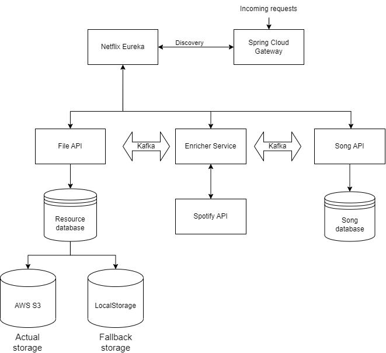

# Microservices Music Metadata Enrichment System

## Description

The Microservices Music Metadata Enrichment System is a scalable and resilient application that aims to enrich music metadata for uploaded song files. It follows a microservices architecture to ensure modularity, flexibility, and easy maintenance. The system comprises several microservices working together to achieve the desired functionality.

### Microservices Overview

1. **File Service**: This service handles the uploading and storage of song files. It supports both local storage and Amazon S3. The uploaded file's metadata, such as the file name, storage type (S3/local), and path, is stored in the database. 

    Reference: **https://github.com/EgorStrupinskiy/enricher-file-api**

2. **Enricher Service**: Upon file upload, this service consumes the file ID from the message queue, downloads the file, and extracts metadata from the song. It utilizes the Spotify API to obtain additional data, such as the author, alternative track name, and duration. The enriched metadata is then sent to another message queue.

    Reference: **https://github.com/EgorStrupinskiy/enricher-searcher**

3. **Song Service**: The Song Service consumes the enriched metadata from the message queue and saves it in its own database. It exposes CRUD endpoints to provide access to the track metadata, including the file ID retrievable through the File API.

    Reference: **https://github.com/EgorStrupinskiy/enricher-song-api**
4. **Netflix Eureka Discovery Service**: The Discovery Service serves as a service registry and allowing microservices to discover and communicate with each other dynamically..

    Reference: **https://github.com/EgorStrupinskiy/enricher-discovery**
5. **Spring Cloud Gateway**: The Gateway Service is responsible for managing all incoming requests and directing them to the appropriate microservices.

    Reference: **https://github.com/EgorStrupinskiy/enricher-default-gateway**

### System Components

- **Spring Cloud Gateway**: Acts as the API gateway, managing all incoming requests and directing them to the appropriate microservices.

- **Service Discovery (Eureka)**: Allows microservices to find and communicate with each other dynamically.

- **Database**: The system uses MySQL database for data persistence.

- **LocalStack**: Used for local testing and development, providing an S3-compatible storage service.

### Technologies and Frameworks

- Spring Boot: For building the microservices.

- Spring Data: For database interacting.

- Spring Cloud: For implementing the microservice's architecture.

- Amazon S3: For cloud-based storage.

- Slf4j: For logging.

- Apache Kafka: For messaging and integration patterns.

- MySQL Database: For data persistence.

## Usage

1. Use the File API to upload a song file.

2. The Enricher Service will automatically enrich the metadata and fetch additional information from the Spotify API.

3. Access the enriched metadata through the Song API.

## Contributing

Contributions to this project are welcome. Feel free to open issues and submit pull requests.
